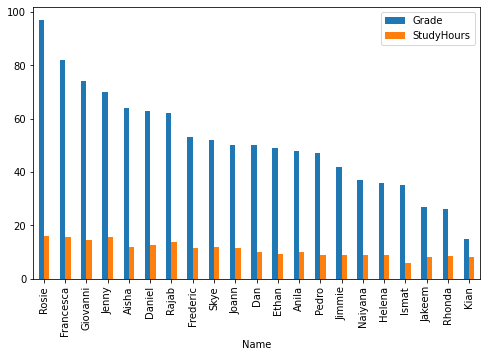
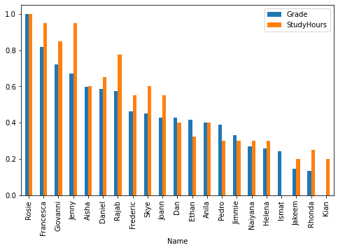

Use Machine Learning Studio when you want to experiment with machine learning models quickly and easily, and the built-in machine learning algorithms are sufficient for your solutions.

To start working on notebooks you will need a compute instance. So create a compute instance and then from terminal you can easily clone a pre-written notebook into your environment.

- There are several editors available to use the notebook - I usually prefer working with Jupyter Notebook {} Editor.
  - Jupter Lab
  - Jupyter
  - Terminal
  - VSCode 
  - RStudio

## Here's one tip to compare two variable with different scaling.

- By Using MinMaxScaling

## AKS
- High scale production deployment | Autoscale | Manage high traffic | GPU support | Real_time
