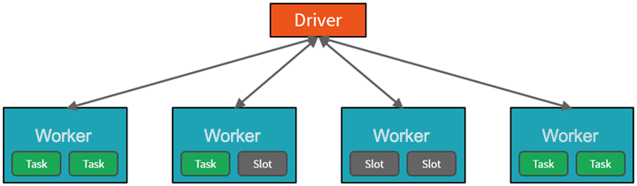

- Azure Databricks is a fully-managed version of the open-source Apache Spark analytics and data processing engine. Azure Databricks is an enterprise-grade and secure cloud-based big data and machine learning platform.
- Databricks provides a notebook-oriented Apache Spark as-a-service workspace environment, making it easy to manage clusters and explore data interactively.
- DBFS : DataBricks File System
- Single Driver | One-or-more Executors 
  - The first level of parallelization is the Executor : a Java virtual machine running on a node, typically, one instance per node.
  - The second level of parallelization is the Slot : the number of which is determined by the number of cores and CPUs of each node.

- Spark is a Distributed computing environment.
